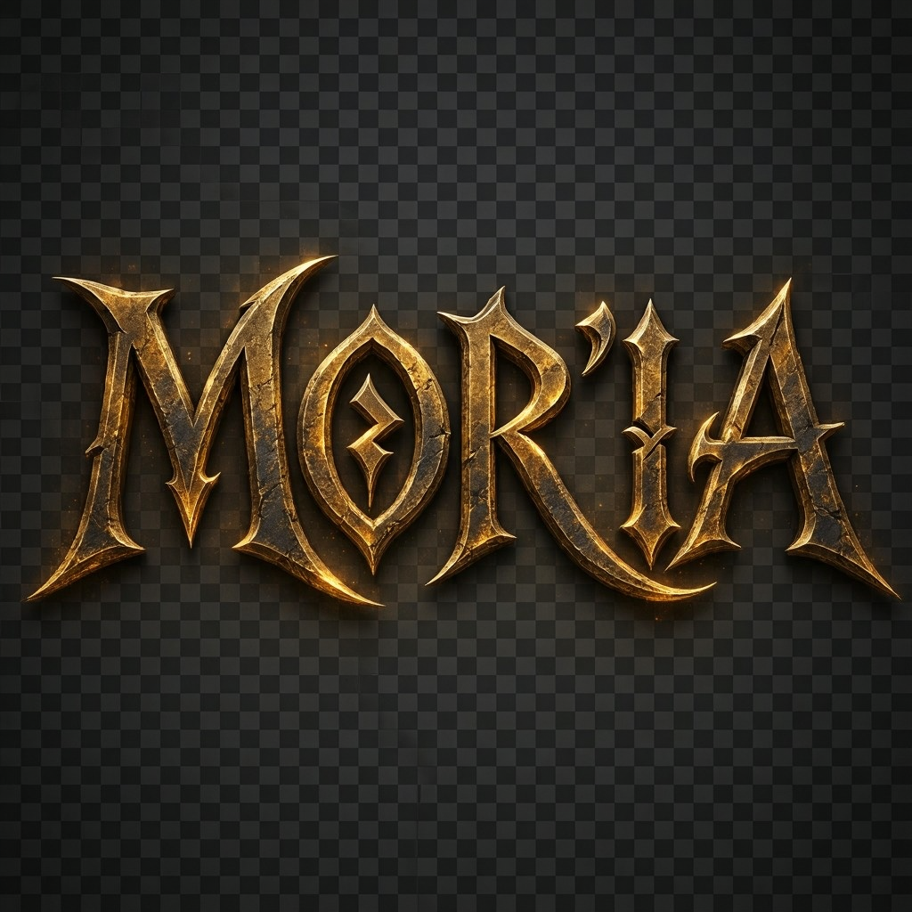
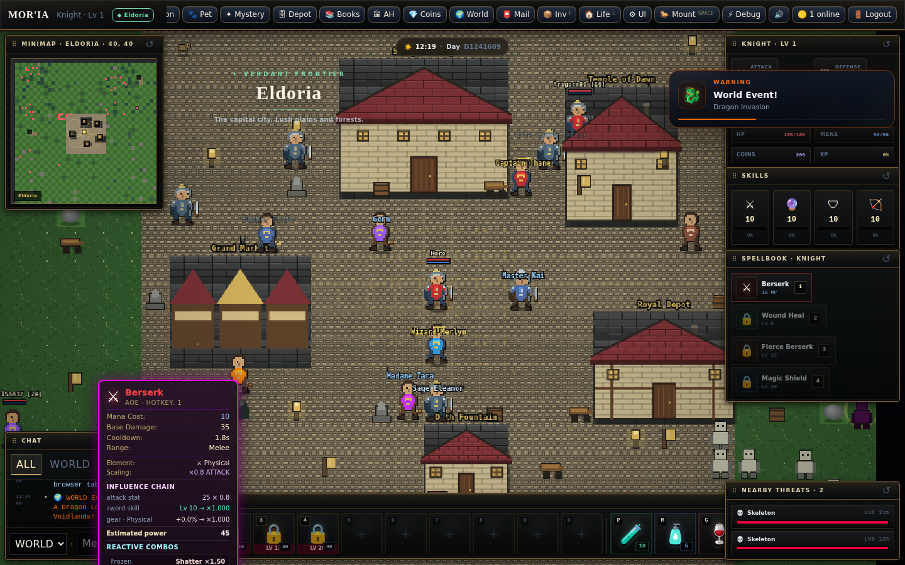
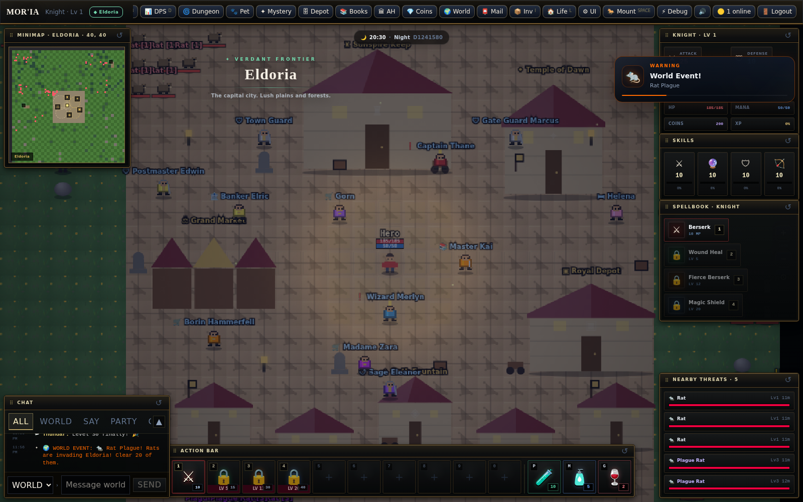
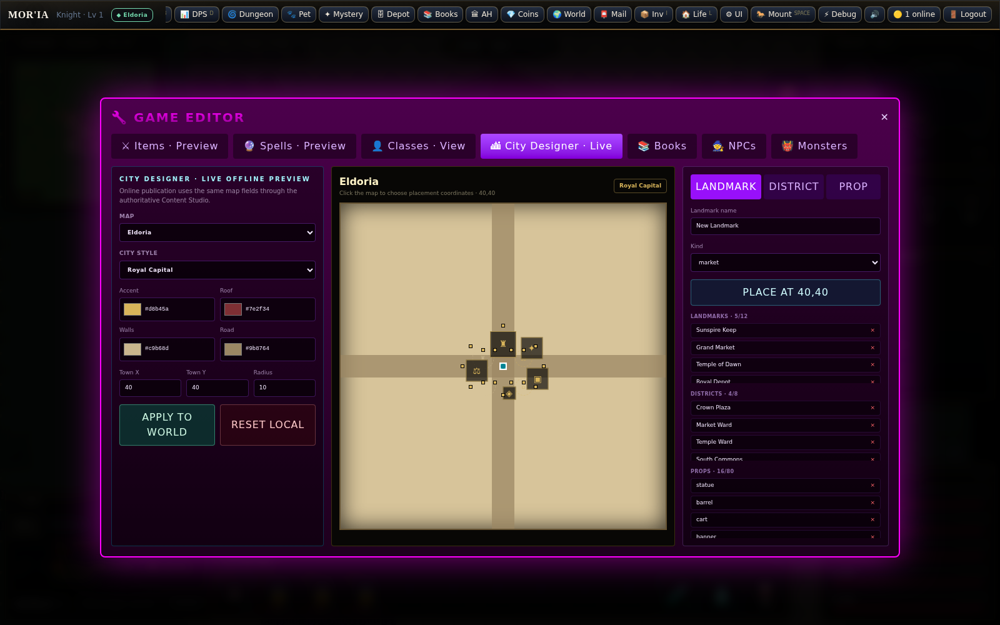
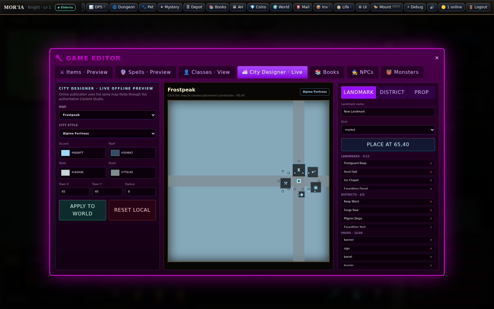

# ⚔️ MOR'IA — REALM OF SHADOWS (MMORPG)

<div align="center">
  
  <p><b>Um MMORPG completo com combate autoritativo, inspiração em Tibia & WoW, 100% no navegador.</b></p>
  <p><b>Versão atual: Mor'ia 9.10 — Elemental Reactions</b></p>
</div>

---

## 🌟 O que é o Mor'ia?

**Mor'ia** é um MMORPG moderno baseado em web que combina a progressão hardcore clássica do **Tibia** (skills por uso, sistema de bênçãos, perda de XP, Caveiras PvP, Depot) com mecânicas modernas do **World of Warcraft** (Cast Bar, Auto-Attack, Talent Trees, Dungeons em Ondas, Raid Warnings e Companions/Pets).

O jogo foi arquitetado de forma **Data-Driven** com um servidor autoritativo em **Node.js + WebSockets** (anti-cheat real), painéis administrativos na web (`/admin`) e ferramentas ingame para criação de itens, feitiços, monstros, NPCs, missões e identidade urbana em tempo real.

---

## ✅ Mor'ia 9.0 — Linha Validada

A linha 9.0 consolida o servidor autoritativo e as evoluções 8.x: combate com feedback visual sem transferir autoridade ao cliente, regiões vivas, itemização procedural server-side, social persistente com ignore autoritativo e um Content Studio com diagnóstico de integridade e validação semântica antes da publicação.

O gate oficial de qualidade executa `npm audit`, TypeScript, build de produção, syntax check do servidor e a suíte server-side completa em Node.js 22. O painel `/admin` exige autenticação administrativa quando exposto fora de localhost; configure `ADMIN_TOKEN` em produção.

---

## 🚀 Mor'ia 9.1 — Alpha Content Expansion

A linha 9.1 adiciona uma base de lançamento alpha orientada a conteúdo: **11 mapas** (10 regiões públicas + **Astra Sanctum, a Ilha dos GMs**), mais de **70 itens**, mais de **70 monstros**, mais de **40 NPCs**, mais de **45 quests**, novos feitiços para as 14 vocações, eventos regionais, lojas e loot tables autoritativas.

Todo esse conteúdo é materializado no ContentDB e pode ser criado/editado/removido pelo `/admin`. Servidores 9.0 existentes migram uma única vez para a base 9.1 preservando valores já personalizados pelo admin. A Ilha GM usa acesso `gm` validado no servidor pela lista **GM Roster** do próprio Admin.

---

## ⚡ Mor'ia 9.10 — Elemental Reactions

A 9.10 transforma as escolas de dano da 9.9 em um sistema de estados e reações autoritativas. Água pode aplicar **Wet**; Raio sobre Wet dispara **Conductive Burst**; Gelo sobre Wet causa **Flash Freeze**; Físico quebra Frozen com **Shatter**; Terra cria **Fractured**; Arcano aplica **Unstable**; Morte aplica **Cursed**; Sagrado purifica Cursed e recebe bônus contra inimigos alinhados à Morte; Natureza e Veneno formam **Toxic/Venom Bloom**.

Os multiplicadores são resolvidos no servidor antes da defesa final, os estados têm duração limitada e o tooltip da spell mostra as combinações possíveis em **Reactive combos**, junto da cadeia de atributos/equipamentos da 9.9.

### Tooltip real — reações elementais



> Evidência visual versionada no próprio repositório: todo print final de evolução deve entrar no README antes do merge.

---

## 🏙️ Mor'ia 9.6 — World Identity & City Designer

A 9.6 transforma cidades e regiões em espaços reconhecíveis pela própria composição do mundo. Os **11 mapas** passam a ter identidade urbana data-driven própria — incluindo **Royal Capital, Harbor City, Alpine Fortress, Forge Citadel, Void Necropolis e Astral Sanctum** — com paletas, distritos, landmarks, ruas e props específicos.

O minimapa deixou de representar uma Eldoria fixa: agora usa o `mapId` atual, terreno/bioma reais, distritos, landmarks, portais, monstros, elites, bosses e a posição do jogador. A malha do terreno é memoizada por mapa para evitar regeneração 80×80 a cada atualização da HUD.

### Gameplay real — Eldoria 9.6



### City Designer — Eldoria / Royal Capital



### City Designer — Frostpeak / Alpine Fortress



### 🛠️ Ferramenta de edição urbana

No **Quick Play**, abra `Ctrl + Shift + A` → **Game Editor** → **City Designer · Live**. A ferramenta permite selecionar qualquer mapa, aplicar presets de identidade urbana, editar cores de paredes/telhados/vias/accent, ajustar centro e raio urbano, clicar no preview para escolher coordenadas e criar/remover **landmarks**, **distritos** e **props**. No modo offline a alteração pode ser aplicada imediatamente ao mundo e o draft é persistido localmente.

No servidor conectado, os mesmos campos (`cityStyle`, `cityAccent`, `roofColor`, `wallColor`, `roadColor`, `districts`, `landmarks` e `props`) fazem parte do **Content Studio autoritativo**, com limites e validação antes da publicação. A camada visual não transfere autoridade de movimento, colisão, teleporte ou acesso ao cliente.

Mais detalhes técnicos: **[Mor'ia 9.6 — World Identity & City Designer](docs/MORIA_9_6_WORLD_IDENTITY_CITY_EDITOR.md)**.

---

## 🎨 Mor'ia 9.5 — Movable HUD & Classic World Polish

A 9.5 é a base visual imediatamente anterior à 9.6. Ela amplia o viewport para **31×19 tiles**, remove a sidebar que consumia largura do mundo, transforma HUD, chat e hotbar em janelas sobrepostas/movíveis com posição persistente e melhora a leitura 2D dos personagens e NPCs. O nameplate do jogador agora mostra **nome, HP e mana acima do avatar**, mantendo a autoridade de gameplay no servidor.

### Gameplay — 9.5


### Comparação — antes da reforma visual (9.4)


### Tela de entrada


Mais detalhes técnicos: **[Mor'ia 9.5 — HUD World Polish](docs/MORIA_9_5_HUD_WORLD_POLISH.md)**.

---

## ✨ Principais Funcionalidades

### ⚔️ 14 Classes (Vocações) Únicas
- **Knight, Paladin, Sorcerer, Druid, Warlock, Rogue, Priest, Death Knight, Monk, Ranger, Necromancer, Berserker, Shaman, Templar**.
- **56 Magias** dedicadas, com escalonamento mágico, coeficientes, custos de mana, tempo de recarga e progressão por nível.

### 🛡️ Progresso & Equipamentos
- **13 Slots de Equipamento:** Weapon, Armor, Helmet, Legs, Boots, Shield, Ring L, Ring R, Amulet, Cloak, Belt, Gloves, Relic.
- **5 Raridades:** Common, Uncommon, Rare, Epic, Legendary.
- **7 Set Bonuses:** Conjuntos que ativam poderes ocultos (+dano, +XP, +lifesteal, +thorns) ao equipar peças compatíveis.
- **12 Gemas & Socketing:** Insira gemas para personalizar seus atributos.
- **Progresso Tibia-Style:** Skills de `Sword`, `Magic`, `Shielding` e `Distance` aumentam **com o uso real** durante as batalhas.
- **14 Talentos em 4 Tiers:** Árvore de talentos customizável com pontos ganhos a cada nível.

### 🐾 Companions, Dungeons & Eventos
- **6 Pets / Companions:** Seguem o jogador, atacam o alvo selecionado automaticamente e causam dano em combate.
- **Dungeon Portal:** Instância em 10 ondas (*Waves*) com dificuldade crescente e chefes desafiadores.
- **Eventos Mundiais:** Invasões globais e chefes mundiais coordenados para todos os jogadores online.
- **Sistema de Quests & Enigmas (Mystery Quests):** Missões com charadas estilo clássico de RPG.

### 💀 Sistema PvP & Economia
- **Sistema de Caveiras (Tibia):** Lawful 🟢, Suspect ⚪, Aggressor 🟡, Outlaw 🟠, Murderer 🔴, Wanted ⚫.
- **Auction House Completa:** Compre e venda itens com outros jogadores.
- **Depot Chest:** 40 slots seguros onde itens nunca são perdidos em caso de morte.
- **Correio (Mailbox):** Envie mensagens, ouro e pacotes com itens para outros jogadores.

---

## 🎮 Controles e Atalhos

| Tecla | Ação |
| :--- | :--- |
| **WASD / Setas** | Movimentar personagem |
| **1 - 4** | Lançar feitiços rápidos |
| **I** | Abrir Mochila (Itens / Crafting / Socketing) |
| **C** | Painel do Personagem (13 Slots / Atributos / Sets) |
| **T** | Árvore de Talentos |
| **Q** | Livro de Missões (Quests) / Conquistas |
| **B** | Bestiário (14 Entradas e Lore) |
| **D** | DPS Meter |
| **R** | Ativar / Desativar Auto-Attack |
| **P / M** | Poção de HP / Poção de MP |
| **E** | Interagir com NPC próximo |
| **Espaço** | Montar / Desmontar (5 Montarias disponíveis) |
| **Ctrl + Shift + A** | Painel Administrativo / Editor de Conteúdo In-Game |
| **+ / -** | Zoom In / Zoom Out no mapa |

---

## 🚀 Como Rodar o Jogo Localmente

### Pré-requisitos
- **Node.js** 18 ou superior ([nodejs.org](https://nodejs.org))

### 1. Iniciar em Modo Completo (Servidor MMO + Cliente Web)

Abra seu terminal e execute:

```bash
# 1. Instalar dependências e compilar o cliente
npm install
npm run build

# 2. Instalar e rodar o Servidor MMO Autoritativo
cd server
npm install
npm start
```

Seu servidor iniciará na porta `3000`:
- **Jogo:** [http://localhost:3000](http://localhost:3000)
- **Painel Admin Web:** [http://localhost:3000/admin](http://localhost:3000/admin)
- **Status / Health:** [http://localhost:3000/health](http://localhost:3000/health)

> Abra o endereço `http://localhost:3000` em **múltiplas abas** do navegador — os jogadores aparecerão na tela e se movimentarão em tempo real!

---

## 🌍 Como Publicar Online para o Mundo (Grátis)

Para a melhor experiência, o projeto está pré-configurado para uma arquitetura híbrida de custo zero:
- **Cliente Web na Vercel** (CDN Global Instantânea) via arquivo `vercel.json`.
- **Servidor MMO no Render.com** (WebSocket 24/7 + Node.js) via arquivo `render.yaml`.

Para instruções completas de deploy, publicação de servidor e como criar novos itens, monstros e mapas usando o painel admin, consulte nosso guia em:
👉 **[Guia Definitivo de Deploy & Criação de Conteúdo](docs/DEPLOY_AND_MODDING_GUIDE.md)**

---

## 📚 Documentação Adicional

- 📖 **[Manual Completo e Lore de Mor'ia](docs/MORIA_DOCUMENTATION.md)** — Explicação detalhada sobre cada feitiço, classe, monstro, bênção, sistema de reputação e economia.
- 🛠️ **[Guia do Servidor & Arquitetura](server/README.md)** — Detalhes sobre o protocolo WebSocket, Heartbeat, Rate-Limiting e estrutura de persistência.
- 🏙️ **[Mor'ia 9.6 — World Identity & City Designer](docs/MORIA_9_6_WORLD_IDENTITY_CITY_EDITOR.md)** — Identidades urbanas data-driven, minimapa real, editor visual e screenshots validados.
- 🎨 **[Mor'ia 9.5 — HUD World Polish](docs/MORIA_9_5_HUD_WORLD_POLISH.md)** — Reforma visual, janelas móveis, viewport e screenshots reais.

---

## 📜 Licença
Distribuído sob a Licença MIT. Veja `LICENSE` para mais informações.
