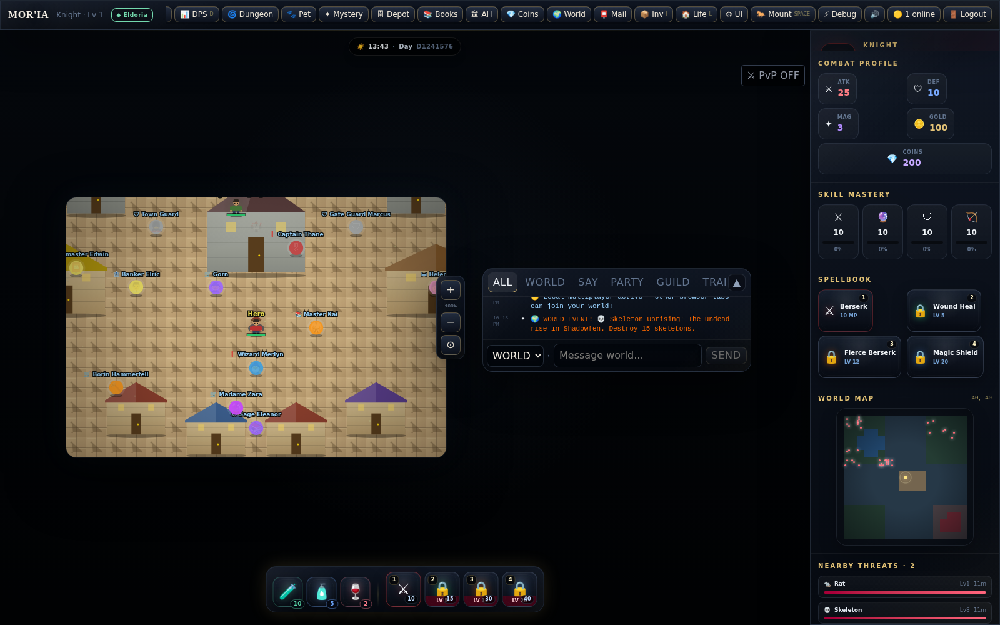
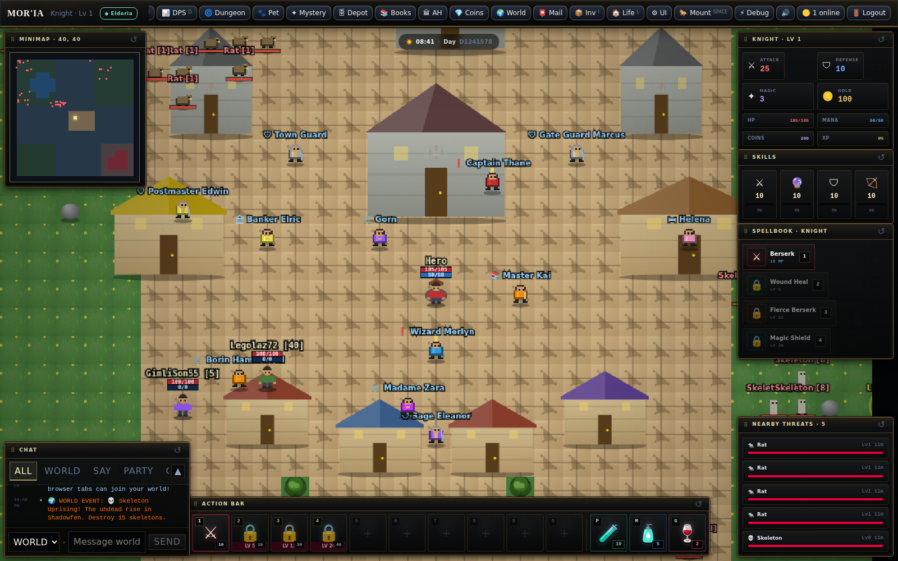
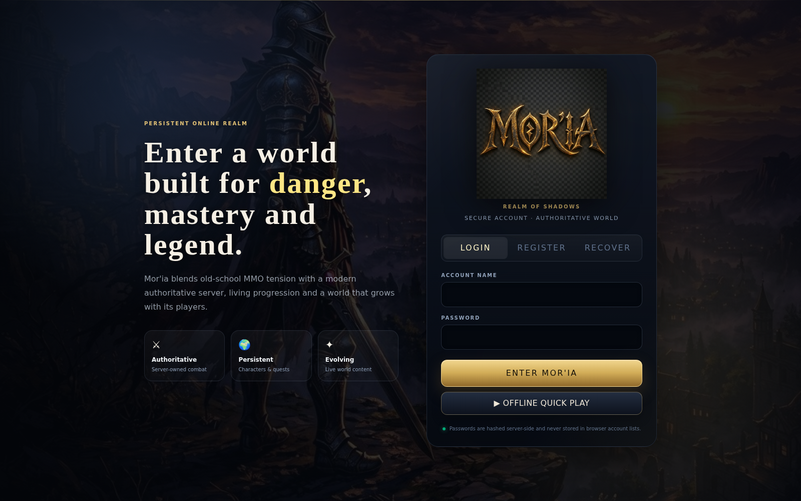

# Mor'ia 9.5 — HUD & World Polish

Mor'ia 9.5 reorganiza a apresentação do cliente para priorizar o mundo jogável e a leitura imediata de combate, mantendo a autoridade de gameplay no servidor. A direção visual é inspirada na clareza de MMORPGs 2D clássicos em grid, com UI, render procedural e identidade próprios de Mor'ia — nenhum asset de terceiros foi incorporado.

## O que mudou

### Mundo ocupa a tela

- viewport passou de `19x13` para `31x19` tiles;
- o antigo sidebar fixo deixou de reservar largura da tela;
- o canvas passou a preencher toda a área disponível abaixo do top bar;
- o mundo continua com `image-rendering: pixelated` e smoothing desligado no renderer de tiles;
- a composição deixa de ter a grande área preta observada na 9.4.

### HUD realmente reposicionável

`MovableHudWindow.tsx` cria uma boundary comum para painéis móveis. Cada janela:

- pode ser arrastada pelo title bar;
- usa Pointer Events + pointer capture;
- é limitada aos bounds da área do jogo;
- salva sua posição no `localStorage`;
- pode ser resetada pelo botão `↺` ou double-click no title bar.

Painéis convertidos para janelas móveis:

- Minimap;
- Combat Profile;
- Skills;
- Spellbook;
- Nearby Threats;
- Active Effects;
- Chat;
- Action Bar.

O top bar global permanece como moldura de navegação, de forma deliberada, assim como em clientes clássicos de MMO.

### Action Bar maior

- dez slots numéricos (`1` a `0`);
- slots de `66x66` no desktop;
- slots vazios permanecem visíveis para leitura da barra completa;
- consumíveis ficam ao lado com teclas `P`, `M` e `G`;
- cooldown, mana, level lock e contagem permanecem legíveis;
- a barra inteira também pode ser movida.

### Status sobre o personagem

O avatar agora apresenta, acima da cabeça:

1. nome;
2. barra de HP;
3. barra de Mana;
4. valores atuais/máximos quando a escala permite.

No modo autoritativo, mana e HP vêm do snapshot real recebido do servidor. O renderer apenas apresenta esses valores.

### Entidades mais próximas de um MMORPG 2D clássico

`classicEntityPresentation.ts` substitui as antigas bolhas circulares por sprites procedurais em blocos/pixels:

- NPCs humanoides têm cabeça, corpo, pernas e leitura específica de role;
- guards, trainers, merchants/bankers e quest NPCs recebem silhuetas/acessórios distintos;
- monstros usam silhuetas diferentes para quadrúpedes, slimes, undead/humanoides e bosses;
- bosses recebem leitura visual adicional;
- toda arte continua sendo procedural e original do projeto.

### Moldura visual

A 9.5 adiciona uma linguagem própria de HUD clássico:

- bronze/dourado escuro;
- painéis quase opacos;
- células retangulares compactas;
- menor dependência de glassmorphism;
- title bars legíveis e com affordance de drag;
- hotbar com frame dedicado.

## Comparação real

As imagens abaixo foram geradas abrindo o build real em Chromium headless e entrando por `OFFLINE QUICK PLAY`. Não são mockups.

### 9.4 — antes

### 9.5 — depois

### Login 9.4 preservado

## Qualidade e regressão

O gate `server/test/hud-world-9-5.test.mjs` protege:

- viewport `31x19`;
- ausência do antigo sidebar fixo de 304px;
- persistência das janelas móveis;
- dez slots da action bar;
- nameplate com HP + mana;
- uso do renderer clássico de entidades;
- manutenção do limite arquitetural de `GameScreen.tsx` em `<= 155 KB`.

A alteração é de apresentação. Combate, inventário, spells, quests, economia e demais regras continuam usando as mesmas boundaries de autoridade existentes.
